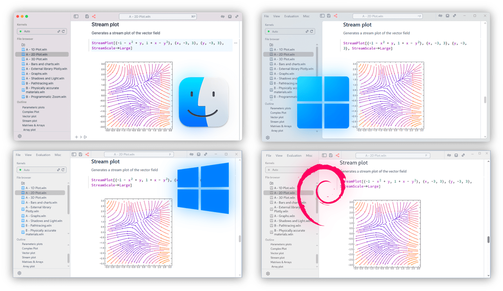

<h1 align="center">WLJS Notebook</h1>
<h2 align="center">Open-source notebook interface for Wolfram Engine</h2>

It is the first open-source solution featuring true 2D math input combined with powerful syntax sugar and the fastest granular interactive evaluation engine, making it ideal for advanced mathematical workflows, scientific computing, and data exploration.


<div align="center">
  <b style="color: var(--ifm-link-color);">
    WLJS Notebook is an interactive computing platform, web-based environment for running Wolfram Language (WL) scripts, Javascript. A lightweight, cross-platform alternative to Mathematica, built using open-source tools and the free Wolfram Engine.
  </b>
</div>

<h3 align="center">
  <a href="https://wljs.io/">Overview 🚀</a> &nbsp;&nbsp; 
  <a href="https://wljs.io/wljs-demo">Online demos 📺</a>
</h3>

The notebook combines live code in WL, JS, Mermaid and many more, GUI blocks for user input, equations, narrative text, visualizations, interactive widgets.


<div class="note">
  <p>
    WLJS Notebook is <b>free software</b> based on the Wolfram Engine.
  </p>
  <p>
    You don’t need Mathematica installed to use WLJS Notebook. <b>No subscription required</b>—just a one-time registration at <em>wolfram.com</em> for personal use.
  </p>
</div>

[](https://doi.org/10.5281/zenodo.15538087)

**This project is not affiliated with, endorsed by, or sponsored by Wolfram Research**

## Resources

- **[Documentation & Tutorials](https://wljs.io/)** 📔
- **[Freeware Wolfram Language Interpreter](https://www.wolfram.com/engine/)**
- **[Wolfram Language Introduction](https://www.wolfram.com/language/elementary-introduction/3rd-ed/01-starting-out-elementary-arithmetic.html)** 🐺
- **[Github Discussions](https://github.com/JerryI/wolfram-js-frontend/discussions)** 💬
- **[Telegram Support Chat](https://t.me/wljs_support)** 🐴

**Recommended [Wolfram Engine](https://www.wolfram.com/engine/): Version > 13.3**

> The algorithms, functions, and other components of the Wolfram Language provided by the Wolfram Engine are the intellectual property of Wolfram Research, Inc.

## We need your support
As an independent open-source project, we’re unaffiliated with Wolfram or any company. Your support keeps this project alive:

- [ ] +1 ⭐️ on this Github repo
- [ ] Share it with your colleague
- [ ] [Buy us a coffee](https://wljs.io/sponsorship) ☕️

---

<div style="display: flex;">


Free code signing on Windows provided by [SignPath.io](https://SignPath.io), certificate by *SignPath Foundation*


</div>

## Showcase

### **[Blog Posts](https://wljs.io/blog)** 🔗
Pages featuring real-world problems solved using WLJS Notebook, published as interactive notebooks running in your browser.

### **[WLJS Notebook Demonstration Project](https://wljs.io/wljs-demo)** 🔗
Notebooks presented as static web pages showcasing various examples demonstrating the power of Wolfram Language and our frontend.

## Why WLJS Notebook?

### Feels like Mathematica and Jupyter
WLJS Notebook is compatible with Wolfram Mathematica and has a flat and minimal notebook structure like in Jupyter Lab. All power of Wolfram Language standard library is at your hands

### Crossplatform
We carefully designed the backend and adjusted our UI to match all platforms: Windows 10/11, macOS, GNU/Linux (GNOME) and **even a web-browser**!



### Batteries included
More than 200 importers/exporters formats. Vast standard library of Wolfram Mathematica (Language) for every computational need, from data analysis to visualization, symbolic computation, and beyond

### Interactive & Powerful
WLJS Notebook is optimized for interactive computing and allows to make complex real-time computations like these ones below


> The entire scene above is generated on the Wolfram Kernel and streamed to WebGL buffers via low-latency binary sockets.

### LLM Integration 🤖
An optional AI-assistant will see directly, edit or add any cell in the notebook. No confirmation, no chat dialogs:


### Command Palette & GUI-in-Code Emulation 🎨
### Native Math Input/Output in the Code Editor 🧮
Write beautiful equations directly within normal Wolfram Language expressions.


🎹 __No need to lift your fingers from the keyboard__


### Editable Output Cells & Advanced Shortcuts
- `Alt+2`, `Cmd+2`: Toggle input cell visibility
- `Ctrl+/`: Create a fraction from selection
- `Ctrl+6`: Create superscript from selection
- `Ctrl+2`: Create square root from selection
- `Ctrl+-`: Create subscript from selection

Or use toolboxes for complex structures like integrals, summations, and Greek letters.

#### Rich Command Palette


### Javascript Sandbox
First class support of Javascript and with a dedicated IPC channel to Wolfram Kernel


### Share Interactive Notes Effortlessly
- __Write once, use forever__
- No breaking changes upon updates
- Keep all dependencies within your notebook
- No CDNs, no external libraries, no WRI services

#### Export to HTML/Markdown/MDX 🗜️
Export entire notebooks as standalone `.html` files, retaining all embedded data—no internet required for viewing.


## Installation 🛠️

### **Wolfram Engine**
[Download Wolfram Engine](https://www.wolfram.com/engine/) (Version 13.3+ recommended). Activation is required after installation.

#### Tested
- Wolfram Engine 13.3 (no copilot)
- Wolfram Engine 13.4 (no copilot)
- Wolfram Engine 14.0
- Wolfram Engine 14.1
- Wolfram Engine 14.2
- Wolfram Engine 14.3

**macOS Installation via Homebrew:**
```shell
brew install --cask wolfram-engine
```

### **WLJS Notebook App ✨**
Download from the **[releases](https://github.com/JerryI/wolfram-js-frontend/releases)** section.

#### CLI Installation
WLJS Notebook provides a CLI tool. You can open a folder in WLJS Notebook with:
```bash
wljs .
```

#### URL Protocol Registration
WLJS Notebook registers the `wljs-message` URL protocol, allowing you to open published notebooks directly from web pages.

### **Windows Installation**
Use the `.exe` installer from the releases page.

### **GNU/Linux Installation**
#### Using `deb` Package
```bash
sudo apt install ./wljs-notebook.deb
```
#### Using `AppImage`
Make it executable and double click to run it


#### Docker Image
*contributed by [@yloose](https://github.com/yloose)*

See [instructions here](./container/README.md)

```bash
docker run -it \
  -v ~/wljs:"/home/wljs/WLJS Notebooks" \
  -v ~/wljs/Licensing:/home/wljs/.WolframEngine/Licensing \
  -e PUID=$(id -u) \
  -e PGID=$(id -g) \
  -p 8000:3000 \
  --name wljs \
  ghcr.io/wljsteam/wolfram-js-frontend:main
```

Then open `http://127.0.0.1:8000`

##### What is included:
- Node 18
- Clang + utils (for WL functions compilation)
- git
- ffmpeg
- curl

## Code signing policy
We sign official desktop releases publised on Github Releases.

### What we sign
- **Windows:** Installers (`.exe`, `.msi`) and executable binaries.
- **macOS:** `.app` bundles and `.dmg` installers.
- **Source archives & checksums:** Each release includes SHA-256 checksums for all artifacts.

### Platforms & identities
- **Windows** — Signed by **SignPath.io** using a certificate issued to **SignPath Foundation**.  
  _Free code signing sponsored by [SignPath.io](https://SignPath.io)._
- **macOS** — Signed with an Apple **Developer ID** certificate owned by our team (`com.coffeeliqueur.*`).  
  Gatekeeper should show the developer as our Developer ID when opening the app.

> Community or third-party builds are **not** covered by our signing policy.

## Team roles and their members
- [**Committers and reviewers**](https://github.com/orgs/WLJSTeam/teams/committers-and-reviewers/)

## Privacy policy
This program / code-base will not transfer any information to other networked systems unless specifically requested by the user or the person installing or operating it. See more at [Privacy Policy](./SECURITY.md).


---

<a href="https://scoutforge.net/reviews/wljs-notebook/" title="Trusted and reviewed by Scout Forge"></a>

---

## **License**
WLJS Notebooks (including all extensions, graphics and sound libraries, frontend and backend) are licensed under GPLv3 👩🏼‍⚖️. 

The algorithms, functions, and other components of the Wolfram Language provided by the freeware distribution of Wolfram Engine are the intellectual property of Wolfram Research, Inc. 

See more at [LICENSE.md](./LICENSE)

